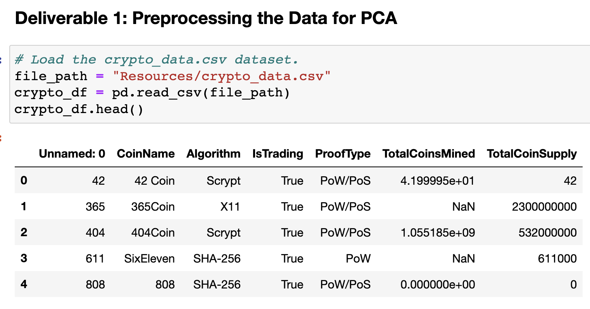
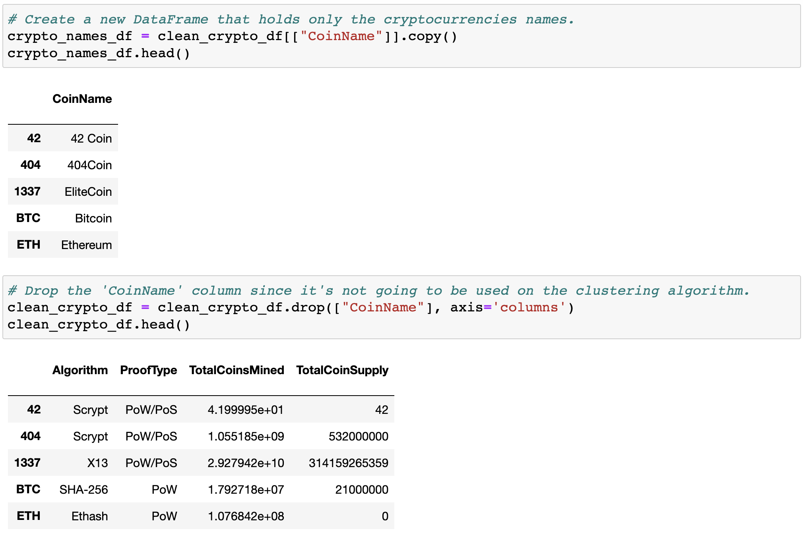
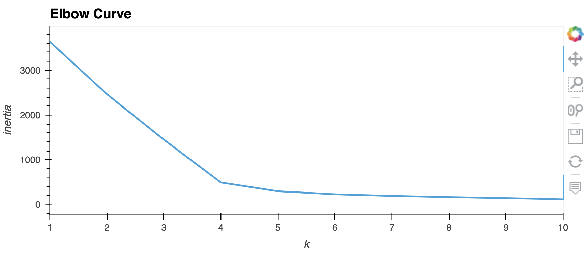
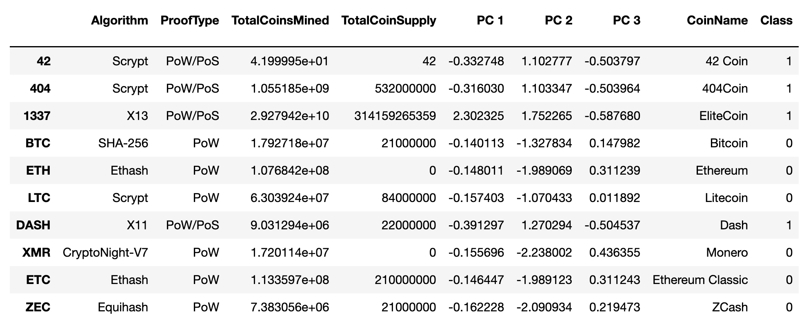

# Cryptocurrencies
Unsupervised Machine Learning and Cryptocurrencies

## Overview 
**Background and Purpose**
In order to offer a cryptocurrency investment portfolio for their customers at Accountability Accounting, we are tasked to create a report that has what cryptocurrencies are currently being offered on the trading market and how to create a classification system using Unsupervised Machine Learning. To group the cryptocurrencies, we are using the clustering algorithm.

Specifically we are creating: 
- Part 1: Preprocessing the Data for PCA
- Part 2: Reducing Data Dimensions Using PCA
- Part 3: Clustering Cryptocurrencies Using K-means
- Part 4: Visualizing Cryptocurrencies Results

## Resources 
- Original Data Source: [crypto_data.csv](https://github.com/meghanhkoon/Cryptocurrencies/commit/f8833afdef808b41db08aaf77dea5fb32a484f30)
- Software: Jupyter Notebook, Python, Python Libraries: ```pandas```, ```hvplot.pandas```, ```plotly```, ```sklearn```, and Anaconda mlenv environment


## Results 
### Preprocessing the data 
Before pre-processing the crypto data, there were 1252 rows of cryptocurrencies in the csv. 

 

Using our knowledge of Pandas, the crypto_data.csv was preprocessed by: 
- Reindexing the dataset.
- Keeping all the cryptocurrencies that are being traded then removing the "IsTrading" column.
- Dropping any rows that have at least one null value.
- Keeping rows where coins are mined ```TotalCoinsMined > 0```.
- Creating a new DataFrame that holds the cryptocurrencies names. Then dropping it from the clean dataset.
- Lastly, getting text features and standardizing the data using ```fit_transform()``` function.

After finally cleaning the data, we were left with **532 cryptocurrencies** that are currently tradable. 

 


### Reducing Data Dimensions Using PCA
Next, we reduced data dimensions using PCA. We used only three principal components and created a new DataFrame with the three Principal Components using the scaled data in the previous part. 


### Clustering Cryptocurrencies Using K-means
To find the best value for ***k***, we used the elbow curve using ```hvPlot``` to find that ***k = 4***.

 

After initializing, fitting and predicting the model, we created a new dataframe ```clustered_df``` that uses the data from both the crypto and pcs dataframes. We then added the last column named "Class" that holds the predictions. The result was the final DataFrame below. 

 


### Visualizing Cryptocurrencies Results
**3D Scatter Plot**

**Table with Tradable Cryptocurrencies (Total of 532)**

**Scatter Plot using ```hvPlot```**
